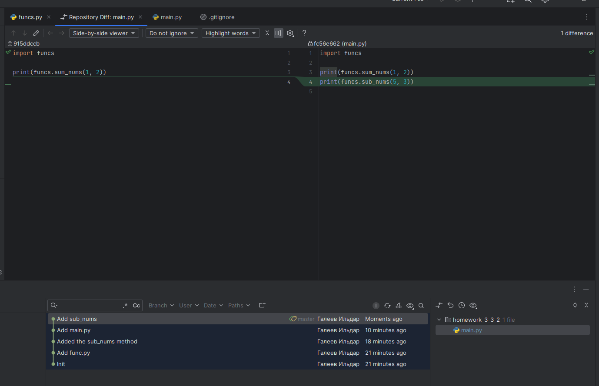

# Урок 11.1.1. Введение в работу с Git

1. Инициализация git репозитория

2. Создаем файл `funcs.py` и коммитим его
3. Добавили изменения в `funcs.py`

4. Добавили `main.py` и добавили в отслеживание

5. Написали код в `main.py` и сделали коммит
6. Внесли новые изменения в `main.py`

7. Подключаем удаленный репозиторий

8. Отправляем изменения в удаленный репозиторий

9. Притягиваем изменения из удаленного репозитория

